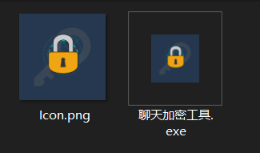
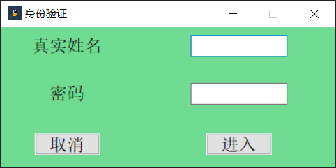
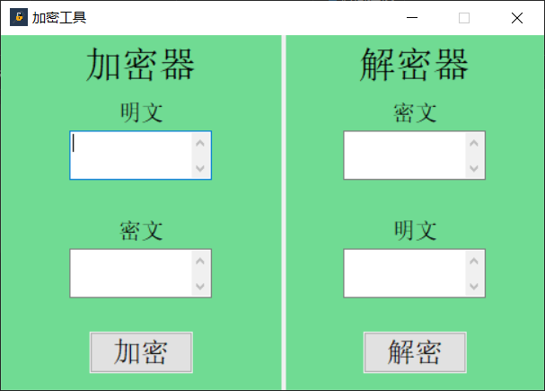

# 聊天加密工具

## 前言
出于对于聊天信息的加密，主要从以下几点考虑：
 - 加密后的文字长短与明文相似
 - 支持中文加密
 - 看起来较舒服
 - 在不知道算法的情况下解密较困难

，从而创建了该加密工具。至此为止，核心部分已经成型，用户界面也已经做好，可支持 Windows 10 系统 64 位及 32 位，可自行从其两个打包好的文件夹中下载。
以下是使用过程，以及今后计划添入的功能。

## 使用方法

### 1. 下载
将 `聊天记录工具.zip` （ 32 位的下载 `聊天加密工具32.zip` )并解压，之后应该是两个文件：

### 2. 运行
此时，可以打开 `聊天加密工具.exe` 先进行试运行，如果正常使用的话应当显示如下界面：

接下来，就可以自行创建快捷方式了。

### 3. 使用
首先，就是登录界面。目前，该应用尚未开放，密码已经公布与试用者的地方了。如果想体验，可以私聊获取可用名字及密码。稍后，将会支持注册功能，敬请期待。

在成功进入了工具之后，有左右两边，即为加密器与解密器。如图。

在需要加密文字时，可以在左半部分的明文输入框内输入文字，点击加密后即可在密文区获得加密过的文字。由于该算法采用一次一密，所以每次生成的密文不一样，可以多次点击加密按钮获取不同的密文。
同理，解密部分亦是如此。在密文区输入要解密的文字，点击解密按钮解密。当然，解密的结果就是固定的了。

## 更新准备
考虑到许多人聊天的时候会更倾向于使用手机，稍后我会继续编写手机小程序版本的加密工具（算法相同）；
其次，还准备为这个工具（电脑版）添入一些~~花里胡哨的~~功能如下。
1. 添加数据库（首先会使用本地数据库）以存储加密、解密的记录
2. 按钮更加便利：加密并复制；粘贴并解密
3. 上文提到的用户管理（仍先存储于本地）
4. 另外，有个大胆的想法，既然这个加密工具仍然无法与微信、QQ等主流聊天工具相连，但可以考虑自制一个聊天工具（猖狂）并在其中加入加密功能。具体细节暂不吐露。

## Bug 提交
再好的程序，难免有 Bug 与不足。如果遇到了 Bug ，如一串文字加密再解密后与原文不同等，请务必提交 Issue ，谢谢配合！
另外，如果有更好的关于更新的功能的想法，欢迎提交 Issue 说明~~
